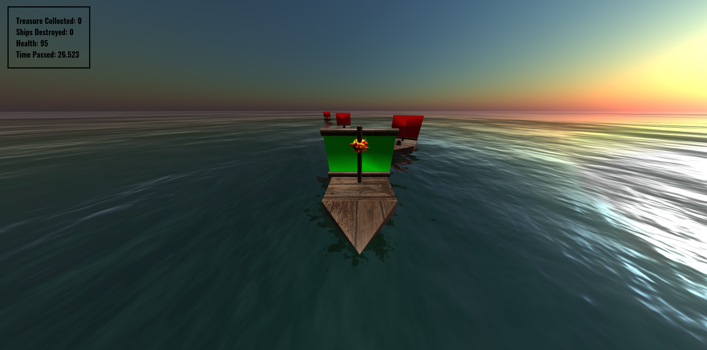

# Ship Battle

<p align="center">

</p>

You are a brave captain who has decided to embark on an adventure to collect the legendary treasure chests of Atlantis. However, you are not alone in your quest. The ocean is vast and dangerous, and hostile enemy ships stand in your way. Will you be able to defeat them and retrieve as many treasure chests as you can?

# Introduction

Ship Battle is a 3D game, built using WebGL and Three.js.

### Player Ship

The player ship can move around the ocean, and can fire cannonballs at enemy ships. The player ship can also collect treasure chests lying around the ocean. The player has a health of 100, and each hit from an enemy ship reduces the player's health by 5. The game ends when the player's health reaches 0.

### Enemy Ships

Enemy ships are randomly spawned within a square area of 250x250 units around the player ship. They can fire cannonballs at the player ship at periodic intervals once they are within a certain distance from the player. Each enemy ship has a health of 100, and each hit from the player ship reduces the enemy ship's health by 25.

### Treasure Chests

Treasure chests are randomly spawned within a square area of 250x250 units around the player ship. They can be collected by the player ship to increase the score of the player.

## Controls

<kbd>W</kbd> - Move forward<br>
<kbd>A</kbd> - Rotate left<br>
<kbd>S</kbd> - Move backward<br>
<kbd>D</kbd> - Rotate right<br>
<kbd>Q</kbd> - Fire cannonball<br>
<kbd>1</kbd> - Third-person view<br>
<kbd>2</kbd> - Bird's-eye view<br>

## Setup

1. Clone the repository.

2. Change the working directory to the repository.
```bash
cd Ship-Battle
```

3. Run the following command to install `http-server`:
```bash
npm i http-server
```

4. Run the following command to start the server:
```bash
http-server
```

5. Open the browser and navigate to `http://localhost:8080/`. You should now be able to play the game.